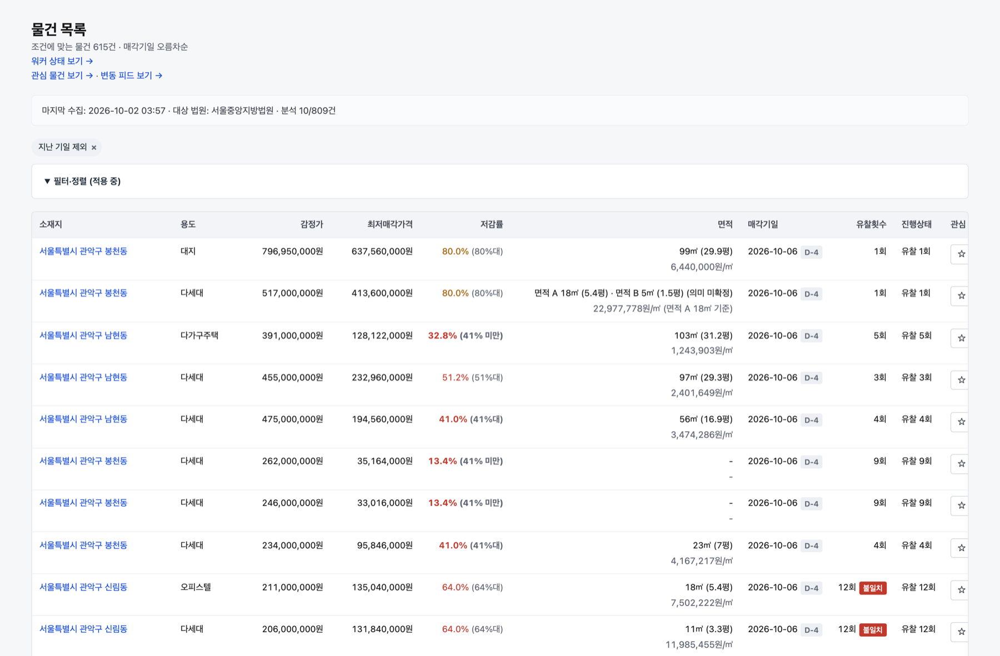
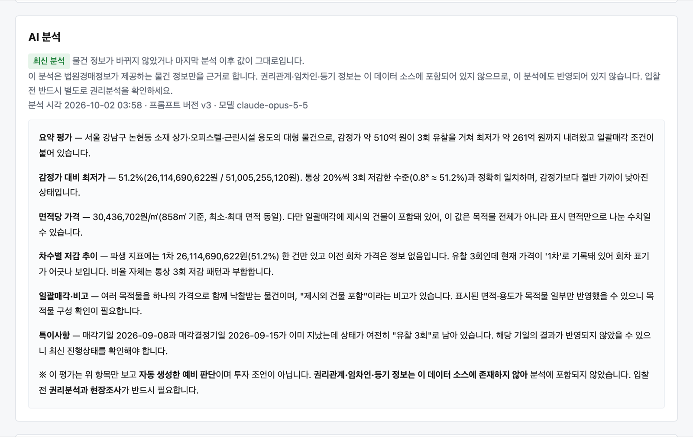
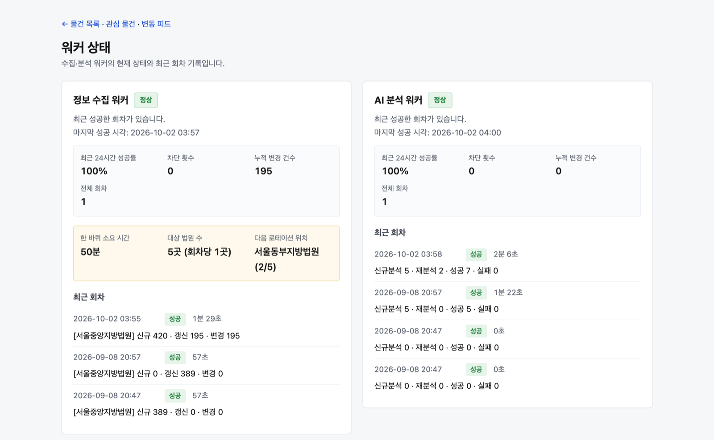
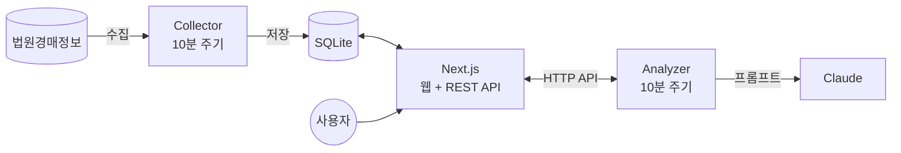
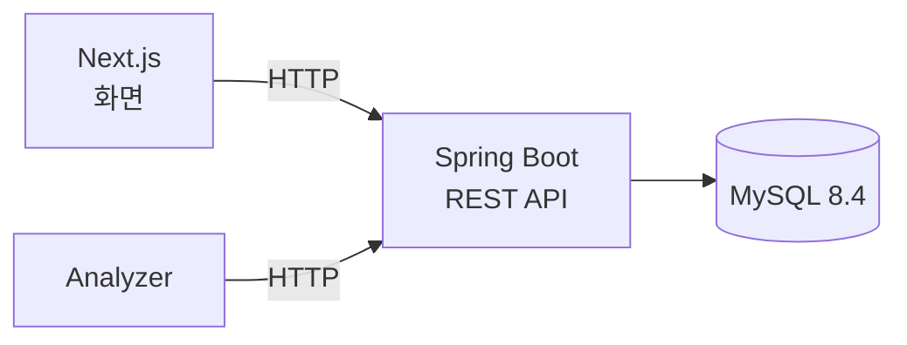

# AuctionBoss

**법원경매 물건을 자동으로 모으고, 가격 변동을 추적하고, 물건마다 AI 분석을 붙여 주는 웹 서비스**

[](https://github.com/CHO-YoungSeok/AuctionBoss/actions/workflows/ci.yml)


> 개인 프로젝트 · 1인 개발 · 2026.09 ~ · 지금은 백엔드를 Spring Boot + MySQL로 옮기는 중입니다 ([로드맵](docs/ROADMAP.md))

<p align="center">
  
</p>

---

## 왜 만들었나

법원경매정보 사이트는 물건의 **현재 상태**만 보여 줍니다.
하지만 입찰을 고민하는 사람에게 중요한 것은 **변화**입니다.
"이 물건이 몇 번 유찰됐고, 최저가가 언제 얼마나 떨어졌는가"는 사이트에서 직접 확인하기 어렵습니다.

AuctionBoss는 물건을 주기적으로 수집해 변화를 기록합니다.
그리고 물건마다 AI가 쓴 요약 평가를 함께 보여 줍니다.

## 주요 기능

| 기능 | 설명 |
| --- | --- |
| **자동 수집** | 법원의 진행 물건을 10분마다 수집해 저장. 법원은 한 번에 한 곳씩 돌아가며 수집하며, 지금 쌓인 데이터는 서울중앙지방법원 809건 |
| **변동 추적** | 최저가 · 유찰횟수 · 매각기일 · 진행상태가 바뀌면 이력으로 기록 |
| **관심 물건 피드** | 관심 등록한 물건의 변동만 모아서 보기 |
| **검색 · 필터** | 지역 · 용도 · 가격대 · 저감률 · 매각기일 등 조건 검색, 조건이 URL에 남아 공유 가능 |
| **AI 분석** | 감정가 대비 가격, 면적당 가격, 유찰 추이를 해석한 요약 리포트 |
| **운영 대시보드** | 수집 · 분석 워커의 실행 기록과 상태를 화면에서 확인 |

## 화면

**AI 분석 리포트** · 물건 상세 화면에서 물건마다 생성된 분석을 보여 줍니다.

<p align="center">
  
</p>

**워커 상태 대시보드** · 수집과 분석 워커의 최근 실행 결과와 성공률을 보여 줍니다.

<p align="center">
  
</p>

---

## 아키텍처

### 지금 운영 구조

웹 서버와 수집 · 분석 워커가 각각 **독립 프로세스**로 동작합니다. 하나가 멈춰도 나머지는 영향을 받지 않습니다.



| 구성 요소 | 역할 |
| --- | --- |
| **Collector** | 외부 소스에서 물건을 가져와 도메인 모델로 바꾼 뒤 저장. 바뀐 값은 변경 이력으로 기록 |
| **Next.js 앱** | 목록 · 상세 · 피드 · 상태 화면과 REST API 제공 |
| **Analyzer** | 분석이 필요한 물건을 API로 받아 Claude로 분석하고 결과를 API로 저장 |

### 이전 중인 구조: Spring Boot + MySQL

SQLite 파일 하나를 웹 앱과 수집 워커가 함께 여는 구조는 서버를 늘리거나 워커를 따로 배포할 수 없습니다. 그래서 백엔드를 Spring Boot + MySQL로 옮기고 있습니다. 단계와 완료 기준은 [로드맵](docs/ROADMAP.md)에 있습니다.



**1단계 완료 (읽기 API)**: `backend/`에 Spring Boot 4 백엔드를 세우고, SQLite 테이블 8개를 Flyway로 MySQL에 옮겼습니다. 읽기 API 5개를 JPA + QueryDSL로 구현했고, **기존 API와 응답이 같은지 계약 테스트 90개로 비교해 모두 일치**합니다. 실명을 가린 실제 데이터 809건을 시드로 씁니다. 화면과 수집 워커는 아직 기존 구조를 씁니다.

**2단계 완료 (쓰기 API)**: 분석 저장, 워커 회차, 관심 물건, 변동 피드, 사진 파일 API를 옮겼고(`POST /api/analyses`, `/api/worker-runs`, `/api/bookmarks`, `/api/feed/read`, `GET /api/photos/...` 등), 시나리오 계약 테스트 7개·115단계가 모두 일치합니다. 개발 환경(시드 MySQL + Spring)에서 **분석 워커 코드 변경 0줄**, 환경 변수만 바꿔 분석 결과가 Spring에 저장되는 것을 확인했습니다. 쓰기 API에는 인증이 없어 Spring 포트는 루프백에만 엽니다.

**3단계 완료 (화면 데이터 포트)**: 화면 5개와 폼·사진 라우트 3개의 데이터 접근을 `src/lib/data-port` 한 곳으로 모았습니다. 구현체는 SQLite와 Spring 둘이고 `AUCTIONBOSS_DATA_SOURCE`(기본 `sqlite`)로 고릅니다. 화면용 읽기 API 5개를 Spring에 더했고(필터 선택지, 분석 이력, 사진 목록, 워커 상태, 수집 로테이션), 시나리오 계약 테스트는 10개·171단계가 모두 일치합니다. 개발 환경에서 `spring` 모드로 띄운 화면 35건을 SQLite 모드와 비교해 **HTML 차이 0건**이었고(스트리밍 조각 번호만 정규화), Spring을 멈추면 SQLite로 대신 보여주지 않고 500으로 끝납니다. 화면 하나가 Spring으로 보내는 요청 수는 상한(최대 11개)을 테스트로 고정했고, 화면 코드가 SQLite를 직접 가져오면 린트가 실패합니다. **운영 화면은 아직 `sqlite`**이고, Spring 전환은 5단계 데이터 이전과 함께 합니다.

**설계에서 지킨 두 가지 원칙**

- **외부 소스는 어댑터 뒤에 격리했습니다.** 수집 대상 사이트의 응답 형식은 `AuctionSource` 어댑터 안에서만 다룹니다. 소스가 바뀌거나 다른 데이터 제공처를 붙여도 서비스 본체는 수정하지 않습니다.
- **분석 워커는 DB에 직접 접근하지 않습니다.** 서버와 HTTP API로만 통신합니다. 그래서 분석 워커를 다른 서버나 컨테이너로 옮겨도 코드가 바뀌지 않습니다.

---

## 기술적 도전과 해결

### 1. 공식 API가 없는 외부 소스를 안정적으로 수집하기

- **문제** 공식 Open API가 없어 사이트 내부 JSON 응답을 사용해야 했습니다. 이 사이트는 접속을 막을 때도 HTTP 200을 돌려줘서, 상태 코드만으로는 실패를 알 수 없었습니다.
- **해결** 모든 응답을 세 단계로 검사합니다. 본문이 JSON인지, 접속 허용 플래그가 정상인지, zod 스키마를 통과하는지 확인합니다. 오류는 네트워크 오류 · 형식 변경 · 접속 차단으로 나눠 다르게 대응합니다.
- **결과** 접속이 막히면 즉시 수집을 멈추고 1시간 쉽니다. 형식이 바뀌면 잘못된 데이터를 저장하지 않고 실패로 기록합니다.

### 2. 대상 서버에 부담을 주지 않는 수집 정책

- **문제** 공공 사이트이므로 요청량을 스스로 엄격하게 제한해야 했습니다.
- **해결** 요청은 동시에 보내지 않고 하나씩 간격을 두고 보냅니다. 한 번 실행할 때 법원 한 곳만 수집하고, 다음 실행에서 다음 법원으로 넘어갑니다. 요청 수가 설정한 상한에 닿으면 다음 법원은 시작하지 않습니다. 사진은 물건마다 요청이 필요해서 별도 워커로 분리했고, 화면을 열 때는 외부로 요청이 나가지 않게 했습니다.
- **결과** 법원을 늘려도 한 번 실행할 때의 요청량은 법원 한 곳 분량으로 유지됩니다.

### 3. AI 분석 품질 문제의 진짜 원인 찾기

- **문제** AI 분석 23건이 실제로 있는 면적과 가격 정보를 "정보 없음"이라고 답했습니다. 처음에는 모델이나 프롬프트 문제로 보였습니다.
- **원인** 분석 워커의 응답 스키마가 새로 추가된 필드 32개를 모르고 있었습니다. zod는 모르는 필드를 조용히 지우기 때문에, 서버는 값을 보냈는데 모델에게는 전달되지 않았습니다.
- **해결** 스키마를 고치고 회귀 테스트를 추가했습니다. 그리고 면적당 가격이나 유찰 추이처럼 계산이 필요한 값은 코드가 미리 계산해 넘기도록 바꿨습니다. 모델은 계산하지 않고 해석만 합니다.
- **결과** 이후 분석은 실제 수치를 근거로 작성됩니다. 프롬프트를 고치기 전에 데이터가 제대로 전달되는지부터 확인해야 한다는 것을 배웠습니다.

### 4. AI 호출 비용 통제

- **문제** 물건 수백 건을 매번 다시 분석하면 비용이 계속 늘어납니다.
- **해결** 분석이 꼭 필요한 물건만 고릅니다. 아직 분석하지 않은 물건, 분석 후 가격 등이 바뀐 물건, 예전 프롬프트로 분석한 물건입니다. 신규 분석과 재분석은 실행당 건수를 따로 제한하고, 같은 물건은 24시간 안에 다시 분석하지 않습니다.
- **결과** 실행당 AI 호출 수에 상한이 생겼고, 신규 물건이 재분석에 밀려 계속 미뤄지는 일도 없습니다.

### 5. 백그라운드 워커가 조용히 멈추는 문제

- **문제** 워커가 멈추면 화면은 정상처럼 보이지만 데이터는 더 이상 갱신되지 않습니다.
- **해결** 워커의 모든 실행을 성공 · 실패 · 차단 · 건너뜀으로 구분해 DB에 기록합니다. 설정한 주기의 3배가 지나도 기록이 없으면 상태 화면에 경고를 표시하고, 목록 화면에도 데이터가 오래됐다는 안내를 띄웁니다.
- **결과** 로그를 뒤지지 않아도 워커 상태를 화면에서 바로 확인할 수 있습니다.

---

## 기술 스택

| 분류 | 기술 | 선택 이유 |
| --- | --- | --- |
| 언어 | TypeScript (strict) | 외부 응답을 도메인 모델로 바꾸는 과정을 타입으로 검증 |
| 웹 | Next.js 15 (App Router), React 19 | 서버 컴포넌트에서 DB를 바로 조회하고, 같은 앱에서 REST API 제공 |
| DB | SQLite (better-sqlite3) → MySQL 8.4 | 처음에는 단일 서버에 맞는 가장 단순한 선택. 서버 분리를 위해 MySQL로 옮기는 중 |
| 백엔드 | Spring Boot 4, Java 21, JPA + QueryDSL, Flyway | 동적 검색은 QueryDSL, 스키마는 버전 관리되는 마이그레이션으로 |
| 검증 | zod | 외부 응답, API 입력, 설정 파일을 런타임에 검증 |
| AI | Claude | API 키가 있으면 Messages API, 없으면 Claude Code CLI로 자동 전환 |
| 테스트 | Vitest, JUnit 5, Testcontainers | TS 1212개, Java 370개(실제 MySQL 컨테이너, 기존 API와의 계약 테스트 읽기 90개 + 시나리오 10개·171단계 포함) |
| 인프라 | Docker Compose, GitHub Actions | 멀티 스테이지 빌드, 헬스체크, TS와 Java 검사를 CI에서 병렬 실행. Kubernetes 매니페스트는 있지만 클러스터에 배포한 적은 없음 |

## 개발 방식

- **스펙 먼저 쓰고 구현했습니다.** 기능마다 제안서 · 설계 · 요구사항 · 작업 목록을 [OpenSpec](openspec/)으로 먼저 작성했습니다. 완료된 기능 18개의 기록이 `openspec/changes/archive/`에 남아 있습니다.
- **모든 변경은 4단계 검사를 통과해야 합니다.** 타입 검사, 테스트, 빌드, 린트를 로컬과 CI에서 똑같이 실행합니다.
- **테스트로 회귀를 막습니다.** 외부 응답은 실제 응답 샘플로, API는 임시 DB로, AI 호출은 가짜 구현을 주입해 테스트합니다.
- **AI 코딩 에이전트를 역할별로 나눠 썼습니다.** Claude Code에서 구현 · 리뷰 · 회귀 검증을 서로 다른 에이전트에 맡기고, 결과를 직접 검토하고 통합했습니다.

---

## 실행 방법

Node.js 22 이상이 필요합니다.

```bash
git clone https://github.com/CHO-YoungSeok/AuctionBoss.git
cd AuctionBoss
npm install

npm run build && npm start   # 터미널 1: 웹 서버 (http://localhost:3000)
npm run collector            # 터미널 2: 수집 워커
npm run analyzer             # 터미널 3: 분석 워커
npm run photos               # 터미널 4: 사진 워커 (상주. 1회만 돌리려면 npm run photos -- --once)
```

분석 워커는 `ANTHROPIC_API_KEY` 환경 변수가 있으면 Claude API를 사용합니다. 없으면 로컬에 로그인된 Claude Code CLI를 사용합니다.

- API 모드 기본 모델은 `claude-opus-5-5`입니다. 비용을 낮추려면 `AUCTIONBOSS_ANALYZE_MODEL=claude-sonnet-5-5`로 바꿉니다(단가 절반).
- 컨테이너로 띄우는 analyzer에는 Claude Code CLI가 없으므로 `ANTHROPIC_API_KEY`가 반드시 필요합니다.
- API 모드는 서버 측 대체가 켜져 있어, 안전 분류기가 거절하면 같은 호출 안에서 다른 모델이 이어받습니다. 실제로 답한 모델이 `analyses.model`에 저장됩니다. 출력이 잘렸거나 끝내 거절되면 분석을 저장하지 않고 실패로 기록합니다.
사진 워커는 30분마다 사진이 없는 물건 최대 5건을 받고, 요청 사이에 30초를 쉽니다. 사진을 받지 못한 물건은 24시간 뒤에 다시 시도합니다. 수집 워커가 접속 차단을 감지하면 사진 워커도 같은 백오프 동안 쉽니다. 이 값들은 `config/collector.json`의 `photos` 절에서 바꿀 수 있습니다.

수집 대상 법원, 실행 주기, 분석 건수 한도도 `config/collector.json`에서 바꿀 수 있습니다.

### Spring 백엔드 (이전 중)

Docker만 있으면 됩니다. 실명을 가린 시드 809건이 자동으로 들어갑니다.

```bash
cp .env.example .env
docker compose up -d mysql backend   # http://localhost:8080/api/items
```

화면을 Spring에서 읽게 해 보려면(개발용, 운영 기본값은 `sqlite`) Spring을 띄운 뒤 다음처럼 실행합니다. `scripts/dev/compare-screens.sh`는 임시 MySQL·Spring·SQLite에 두 모드를 띄워 화면을 비교합니다(Docker·JDK 필요).

```bash
AUCTIONBOSS_DATA_SOURCE=spring AUCTIONBOSS_SPRING_BASE=http://localhost:8080 npm run dev
bash scripts/dev/compare-screens.sh
```

### 전체 검사

```bash
npx tsc --noEmit && npm test && npm run build && npm run lint   # TypeScript
(cd backend && ./gradlew check)                                  # Java (Docker 필요)
```

## 폴더 구조

```
src/
├── app/            # 화면(목록 · 상세 · 관심 · 피드 · 상태)과 REST API
└── lib/
    ├── domain/     # 도메인 모델과 비즈니스 규칙
    ├── sources/    # 외부 소스 어댑터 (격리 경계)
    └── db/         # 스키마와 저장소
workers/            # 수집 · 분석 · 사진 워커, AI 프롬프트
backend/            # Spring Boot 백엔드 (Flyway 스키마, JPA 엔티티, QueryDSL 검색, 계약 테스트)
scripts/seed/       # 실명 가림 시드 생성, 계약 테스트용 정답 응답 생성
openspec/           # 기능별 스펙과 설계 기록
k8s/                # Kubernetes 매니페스트
```

## 한계와 다음 단계

- **인증이 없습니다.** 지금은 개인용으로 설계했습니다. 여러 사용자를 지원하려면 로그인과 사용자별 관심 목록이 필요합니다.
- **비공식 데이터에 의존합니다.** 소스 형식이 바뀌면 수집이 멈춥니다. 어댑터 구조 덕분에 상용 데이터 API로 교체할 수 있습니다.
- **권리 분석은 하지 않습니다.** 등기부나 임차인 정보는 이 소스에 없습니다. AI 분석은 참고용 요약이며 투자 판단을 대신하지 않습니다.
- 사진 워커는 실제 소스에서 사진 1건을 받아 저장하는 것까지 확인했습니다. 장기간 상주 운영은 검증하지 않았습니다.
- 수집한 데이터는 개인 열람 용도로만 사용합니다.

## 더 보기

- [레퍼런스](docs/REFERENCE.md): 설정, 환경 변수, REST API, 데이터 모델, 워커 동작
- [기능 스펙](openspec/specs/): 기능별 요구사항
- [개발 기록](docs/DEVELOPMENT_NOTES.md): 개발 중 사이클마다 남긴 실측 수치와 설계 판단
