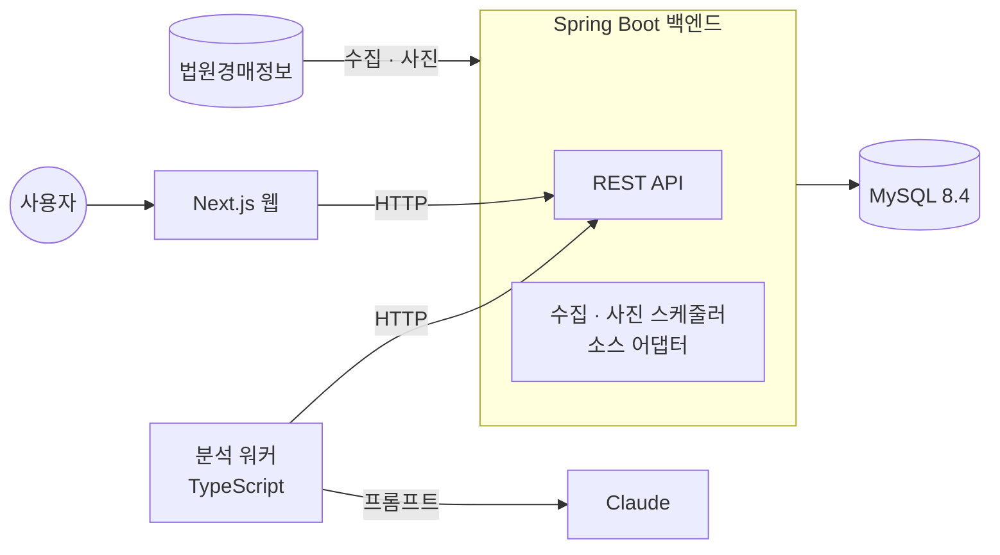

# AuctionBoss

**법원경매 물건을 자동으로 모으고, 가격 변동을 추적하고, 물건마다 AI 분석을 붙여 주는 웹 서비스**

[](https://github.com/CHO-YoungSeok/AuctionBoss/actions/workflows/ci.yml)


> 개인 프로젝트 · 1인 개발 · 2026.09 ~ · 백엔드를 SQLite 기반 Next.js에서 Spring Boot + MySQL로 옮기는 5단계를 마쳤습니다 ([로드맵](docs/ROADMAP.md))

<p align="center">
  
</p>

---

## 왜 만들었나

법원경매정보 사이트는 물건의 **현재 상태**만 보여 줍니다.
하지만 입찰을 고민하는 사람에게 중요한 것은 **변화**입니다.
"이 물건이 몇 번 유찰됐고, 최저가가 언제 얼마나 떨어졌는가"는 사이트에서 직접 확인하기 어렵습니다.

AuctionBoss는 물건을 주기적으로 수집해 변화를 기록합니다.
그리고 물건마다 AI가 쓴 요약 평가를 함께 보여 줍니다.

## 주요 기능

| 기능 | 설명 |
| --- | --- |
| **자동 수집** | 법원의 진행 물건을 10분마다 수집해 저장. 법원은 한 번에 한 곳씩 돌아가며 수집. 운영 전환 직후 기준 물건 1,275건(서울중앙 809건 + 서울동부 첫 수집 466건) |
| **변동 추적** | 최저가 · 유찰횟수 · 매각기일 · 진행상태가 바뀌면 이력으로 기록 |
| **관심 물건 피드** | 관심 등록한 물건의 변동만 모아서 보기 |
| **검색 · 필터** | 지역 · 용도 · 가격대 · 저감률 · 매각기일 등 조건 검색, 조건이 URL에 남아 공유 가능 |
| **AI 분석** | 감정가 대비 가격, 면적당 가격, 유찰 추이를 해석한 요약 리포트 |
| **운영 대시보드** | 수집 · 사진 · 분석 워커의 실행 기록과 상태를 화면에서 확인 |

## 화면

**AI 분석 리포트** · 물건 상세 화면에서 물건마다 생성된 분석을 보여 줍니다.

<p align="center">
  
</p>

**워커 상태 대시보드** · 수집과 분석 워커의 최근 실행 결과와 성공률을 보여 줍니다.

<p align="center">
  
</p>

---

## 아키텍처

Spring Boot 백엔드가 MySQL의 **유일한 주인**입니다. 수집 · 사진 워커는 백엔드 안의 스케줄러이고, 웹과 분석 워커는 HTTP로만 백엔드와 통신합니다. 서비스 4개(`mysql`, `backend`, `web`, `analyzer`)가 각각 독립된 컨테이너입니다.



| 구성 요소 | 역할 |
| --- | --- |
| **Spring Boot 백엔드** | REST API, 수집 · 사진 회차(로테이션, 요청 상한, 차단 감지와 공유 백오프), 변경 이력 기록. 두 인스턴스가 떠도 MySQL `GET_LOCK`으로 회차가 겹치지 않음 |
| **Next.js 웹** | 목록 · 상세 · 관심 · 피드 · 상태 화면. 데이터 접근은 `src/lib/data-port` 한 곳을 거쳐 백엔드 HTTP로만 함 |
| **분석 워커** | 분석이 필요한 물건을 API로 받아 Claude로 분석하고 결과를 API로 저장 |

**설계에서 지킨 원칙**

- **외부 소스는 어댑터 뒤에 격리했습니다.** 수집 대상 사이트의 응답 형식은 `AuctionSource` 어댑터 안에서만 다룹니다. 소스가 바뀌거나 다른 데이터 제공처를 붙여도 서비스 본체는 수정하지 않습니다. 어댑터 밖으로 소스 형식이 새지 않는 것은 ArchUnit 규칙과 필드명 누출 검사로 강제합니다.
- **분석 워커는 DB에 직접 접근하지 않습니다.** 서버와 HTTP API로만 통신합니다. 5단계 전환 때 분석 워커 코드는 한 줄도 바뀌지 않았고 접속 주소 환경 변수만 백엔드로 돌렸습니다.
- **운영 구성이 빈 DB로 실제 사이트에 요청하지 않게 막았습니다.** 데이터 이전 완료 표식이 없으면 백엔드가 기동을 거부합니다.

## Spring 이전 여정

처음에는 Next.js 앱, 수집 워커, SQLite 파일 하나로 시작했습니다. 서버를 늘리거나 워커를 따로 배포할 수 없는 구조여서 백엔드를 5단계로 나눠 옮겼습니다. 단계마다 "같은 동작인가"를 어떻게 증명했는지가 핵심입니다. 단계와 완료 기준은 [로드맵](docs/ROADMAP.md), 수치는 [개발 기록](docs/DEVELOPMENT_NOTES.md)에 있습니다.

| 단계 | 한 일 | 증명 방법 |
| --- | --- | --- |
| **1. 계약 골든** | `backend/`에 Spring Boot 4 + MySQL을 세우고 테이블 8개를 Flyway로 옮겨 읽기 API 5개를 JPA + QueryDSL로 구현. 실명을 가린 실제 데이터 809건을 시드로 사용 | 기존 API가 낸 응답을 정답으로 저장해 두고 같은 요청에 같은 JSON이 나오는지 비교하는 계약 테스트 90개 일치 |
| **2. 쓰기 API** | 분석 저장, 워커 회차, 관심 물건, 변동 피드, 사진 파일 API 이전 | 시나리오 계약 테스트 7개 · 115단계 일치. 개발 환경에서 분석 워커 코드 변경 0줄, 환경 변수만 바꿔 분석 결과가 Spring에 저장됨 |
| **3. 화면 데이터 포트** | 화면의 데이터 접근을 `src/lib/data-port` 한 곳으로 모으고 SQLite 구현체와 Spring 구현체를 환경 변수로 선택 | 화면 5개와 변형 35건의 HTML이 두 모드에서 차이 0건(개발 환경, 스트리밍 조각 번호만 정규화). 화면당 백엔드 요청 수 상한(최대 11개)을 테스트로 고정. 시나리오 계약 10개 · 171단계 일치 |
| **4. 수집기 이식** | 소스 어댑터, 수집 회차, 사진 워커를 Java로 이식. 물건 저장과 변경 이력은 한 트랜잭션, `GET_LOCK`으로 단일 실행 | TS가 하는 일을 정답으로 뽑아 비교: 어댑터 골든 34사례(요청 헤더 · 본문 · 대기 시간 포함), 저장 골든 10시나리오 · 44단계 일치. 실제 사이트에는 요청 4개만 보내 TS가 저장한 같은 물건 37건과 불일치 0건 |
| **5. 데이터 이전 · 전환 · 은퇴** | 운영 데이터를 SQLite에서 MySQL로 이전하고, 화면 · 수집 · 사진을 한 번에 Spring으로 전환한 뒤 SQLite · TS 수집기 · Next JSON API를 은퇴 | 두 언어가 코드를 공유하지 않고 같은 규칙으로 계산한 테이블별 SHA-256 8/8 일치, 이전 뒤 API 3,326건 · 화면 18건 불일치 0. 운영 복사본과 가짜 소스로 전환 · 재실행 · 롤백을 리허설(롤백 16.5초, 런북 결함 2건 발견·수정) |

**5단계 실제 전환(2026-10-09)** 에서 잰 값: 가져오기 약 4초(행 4,856개), 쓰기 정지에서 서비스 재개까지 4분 4초, 수집 공백 약 17시간 51분. 첫 Spring 수집은 신규 466건에 성공했고, 첫 사진 회차는 5건 중 3건을 저장했습니다(2건은 사이트 응답 구조가 달라 실패, 원인은 조사 전). 은퇴 뒤 웹 이미지는 1.49GB에서 1.07GB로, TS 테스트는 1,350개에서 683개로 줄었습니다. 줄어든 테스트마다 같은 동작을 덮는 Java 테스트를 짝지었고, 동결한 계약 골든은 은퇴 전후 바뀌지 않았습니다. 은퇴 직전 코드는 git 태그 `pre-retire-sqlite`에 있어 되돌릴 수 있습니다.

---

## 기술적 도전과 해결

### 1. 공식 API가 없는 외부 소스를 안정적으로 수집하기

- **문제** 공식 Open API가 없어 사이트 내부 JSON 응답을 사용해야 했습니다. 이 사이트는 접속을 막을 때도 HTTP 200을 돌려줘서, 상태 코드만으로는 실패를 알 수 없었습니다.
- **해결** 모든 응답을 세 단계로 검사합니다. 본문이 JSON인지, 접속 허용 플래그가 정상인지, 정의한 응답 스키마를 통과하는지 확인합니다. 오류는 네트워크 오류 · 형식 변경 · 접속 차단으로 나눠 다르게 대응합니다.
- **결과** 접속이 막히면 즉시 수집을 멈추고 1시간 쉽니다. 형식이 바뀌면 잘못된 데이터를 저장하지 않고 실패로 기록합니다.

### 2. 대상 서버에 부담을 주지 않는 수집 정책

- **문제** 공공 사이트이므로 요청량을 스스로 엄격하게 제한해야 했습니다.
- **해결** 요청은 동시에 보내지 않고 하나씩 간격을 두고 보냅니다. 한 번 실행할 때 법원 한 곳만 수집하고, 다음 실행에서 다음 법원으로 넘어갑니다. 요청 수가 설정한 상한에 닿으면 다음 법원은 시작하지 않습니다. 사진은 물건마다 요청이 필요해서 별도 워커로 분리했고, 화면을 열 때는 외부로 요청이 나가지 않게 했습니다.
- **결과** 법원을 늘려도 한 번 실행할 때의 요청량은 법원 한 곳 분량으로 유지됩니다.

### 3. AI 분석 품질 문제의 진짜 원인 찾기

- **문제** AI 분석 23건이 실제로 있는 면적과 가격 정보를 "정보 없음"이라고 답했습니다. 처음에는 모델이나 프롬프트 문제로 보였습니다.
- **원인** 분석 워커의 응답 스키마가 새로 추가된 필드 32개를 모르고 있었습니다. zod는 모르는 필드를 조용히 지우기 때문에, 서버는 값을 보냈는데 모델에게는 전달되지 않았습니다.
- **해결** 스키마를 고치고 회귀 테스트를 추가했습니다. 그리고 면적당 가격이나 유찰 추이처럼 계산이 필요한 값은 코드가 미리 계산해 넘기도록 바꿨습니다. 모델은 계산하지 않고 해석만 합니다.
- **결과** 이후 분석은 실제 수치를 근거로 작성됩니다. 프롬프트를 고치기 전에 데이터가 제대로 전달되는지부터 확인해야 한다는 것을 배웠습니다.

### 4. AI 호출 비용 통제

- **문제** 물건 수백 건을 매번 다시 분석하면 비용이 계속 늘어납니다.
- **해결** 분석이 꼭 필요한 물건만 고릅니다. 아직 분석하지 않은 물건, 분석 후 가격 등이 바뀐 물건, 예전 프롬프트로 분석한 물건입니다. 신규 분석과 재분석은 실행당 건수를 따로 제한하고, 같은 물건은 24시간 안에 다시 분석하지 않습니다.
- **결과** 실행당 AI 호출 수에 상한이 생겼고, 신규 물건이 재분석에 밀려 계속 미뤄지는 일도 없습니다.

### 5. 백그라운드 워커가 조용히 멈추는 문제

- **문제** 워커가 멈추면 화면은 정상처럼 보이지만 데이터는 더 이상 갱신되지 않습니다.
- **해결** 워커의 모든 실행을 성공 · 실패 · 차단 · 건너뜀으로 구분해 DB에 기록합니다. 설정한 주기의 3배가 지나도 기록이 없으면 상태 화면에 경고를 표시하고, 목록 화면에도 데이터가 오래됐다는 안내를 띄웁니다.
- **결과** 로그를 뒤지지 않아도 워커 상태를 화면에서 바로 확인할 수 있습니다.

---

## 기술 스택

| 분류 | 기술 | 선택 이유 |
| --- | --- | --- |
| 백엔드 | Spring Boot 4, Java 21, JPA + QueryDSL, Flyway | 동적 검색은 QueryDSL, 스키마는 버전 관리되는 마이그레이션으로. 수집 스케줄러와 단일 실행 잠금도 여기서 |
| DB | MySQL 8.4 | 서버 분리와 여러 인스턴스를 위해 SQLite에서 이전(5단계). 이전 도구는 한 트랜잭션 가져오기와 전수 해시 검증 |
| 웹 | Next.js 15 (App Router), React 19, TypeScript (strict) | 서버 컴포넌트에서 데이터 포트를 거쳐 백엔드를 조회 |
| 검증 | zod (웹 · 분석 워커) | 백엔드 API 응답과 설정 파일을 런타임에 검증 |
| AI | Claude | API 키가 있으면 Messages API, 없으면 Claude Code CLI로 자동 전환 |
| 테스트 | Vitest 683개, JUnit 5 + Testcontainers 789개 | Java는 실제 MySQL 컨테이너 위에서 기존 API와의 계약 골든(읽기 90 + 시나리오 10), 수집 동등성 골든(어댑터 34사례 + 저장 10시나리오 · 44단계), 이전 해시 골든을 포함 |
| 인프라 | Docker Compose, GitHub Actions | 멀티 스테이지 빌드, 헬스체크, TS와 Java 검사를 CI에서 병렬 실행. Kubernetes 매니페스트는 정적 검증만 했고 클러스터에 배포한 적은 없음 |

## 개발 방식

- **스펙 먼저 쓰고 구현했습니다.** 기능마다 제안서 · 설계 · 요구사항 · 작업 목록을 [OpenSpec](openspec/)으로 먼저 작성했습니다. 완료된 change 24개의 기록이 `openspec/changes/archive/`에 남아 있습니다.
- **모든 변경은 게이트를 통과해야 합니다.** 웹은 타입 검사 · 테스트 · 빌드 · 린트, 백엔드는 `./gradlew check`를 로컬과 CI에서 똑같이 실행합니다.
- **테스트로 회귀를 막습니다.** 외부 응답은 실제 응답 샘플로, 백엔드는 실제 MySQL 컨테이너(Testcontainers)로, AI 호출은 가짜 구현을 주입해 테스트합니다.
- **AI 코딩 에이전트를 역할별로 나눠 썼습니다.** Claude Code에서 구현 · 리뷰 · 회귀 검증을 서로 다른 에이전트에 맡기고, 결과를 직접 검토하고 통합했습니다.

---

## 실행 방법

Docker가 필요합니다. 웹을 로컬에서 개발하려면 Node.js 22 이상, 백엔드를 빌드하려면 JDK 21이 필요합니다.

```bash
git clone https://github.com/CHO-YoungSeok/AuctionBoss.git
cd AuctionBoss
cp .env.example .env     # DB 접속 정보(DB_NAME, DB_USER, DB_PASSWORD, MYSQL_ROOT_PASSWORD)를 채웁니다
```

**시드로 가볍게 둘러보기** (실명을 가린 809건이 자동으로 들어갑니다. 수집은 꺼져 있고 외부 요청이 나가지 않습니다):

```bash
docker compose -p auctionboss-smoke -f docker-compose.smoke.yml up -d --wait
curl http://localhost:18080/api/items
```

**웹까지 띄워 화면 보기** (위 스모크 백엔드를 쓰는 개발 모드):

```bash
npm install
AUCTIONBOSS_DATA_SOURCE=spring AUCTIONBOSS_SPRING_BASE=http://localhost:18080 npm run dev   # http://localhost:3000
```

**운영 구성**은 저장소 루트의 `docker compose up`입니다(`mysql` · `backend` · `web` · `analyzer`). 백엔드가 수집 · 사진 스케줄러를 켜고 실제 사이트에 요청하므로, **이전 완료 표식이 없으면 백엔드가 뜨지 않습니다**(그에 묶인 웹 · 분석 워커도 뜨지 않습니다). 설정과 환경 변수는 [레퍼런스](docs/REFERENCE.md), 전환 기록과 롤백 절차는 [레퍼런스 9절](docs/REFERENCE.md#9-운영-전환-기록)과 [10절](docs/REFERENCE.md#10-롤백-태그--백업으로-되돌리기)입니다.

분석 워커는 `ANTHROPIC_API_KEY` 환경 변수가 있으면 Claude API를 사용합니다. 없으면 로컬에 로그인된 Claude Code CLI를 사용합니다(`AUCTIONBOSS_API_BASE`를 백엔드 주소로 지정하고 `npm run analyzer`).

- API 모드 기본 모델은 `claude-opus-5-5`입니다. 비용을 낮추려면 `AUCTIONBOSS_ANALYZE_MODEL=claude-sonnet-5-5`로 바꿉니다(단가 절반).
- 컨테이너로 띄우는 analyzer에는 Claude Code CLI가 없으므로 `ANTHROPIC_API_KEY`가 반드시 필요합니다.
- API 모드는 서버 측 대체가 켜져 있어, 안전 분류기가 거절하면 같은 호출 안에서 다른 모델이 이어받습니다. 실제로 답한 모델이 `analyses.model`에 저장됩니다. 출력이 잘렸거나 끝내 거절되면 분석을 저장하지 않고 실패로 기록합니다.

사진은 30분마다 사진이 없는 물건 최대 5건을 받고, 요청 사이에 30초를 쉽니다. 사진을 받지 못한 물건은 24시간 뒤에 다시 시도합니다. 수집이 접속 차단을 감지하면 사진도 같은 백오프 동안 쉽니다. 수집 대상 법원, 실행 주기, 분석 · 사진 건수 한도는 `config/collector.json`에서 바꿉니다.

### 전체 검사

```bash
npx tsc --noEmit && npm test && npm run build && npm run lint   # TypeScript (테스트 683개)
(cd backend && ./gradlew check)                                  # Java (테스트 789개, Docker 필요)
```

## 폴더 구조

```
src/
├── app/            # 화면(목록 · 상세 · 관심 · 피드 · 상태)과 폼 · 사진 · 헬스 라우트
└── lib/
    ├── data-port/  # 화면의 데이터 접근 유일 경로 (Spring 구현체)
    └── domain/     # 도메인 모델과 순수 규칙
workers/            # 분석 워커, AI 프롬프트
backend/            # Spring Boot 백엔드 (API, 수집 · 사진 스케줄러, 소스 어댑터, 이전 도구, Flyway, 계약 테스트)
scripts/            # 개발 검증 스크립트, 실명 가림 순수 함수
openspec/           # 기능별 스펙과 설계 기록
k8s/                # Kubernetes 매니페스트
```

## 한계와 다음 단계

- **인증이 없습니다.** 지금은 개인용으로 설계했습니다. 쓰기 API가 열려 있어 백엔드 포트는 루프백에만 엽니다. 여러 사용자를 지원하려면 로그인과 사용자별 관심 목록이 필요합니다(로드맵 7단계).
- **상시 운영 환경이 없습니다.** 전환 때 수집 · 사진을 실제 사이트에서 한 회차씩만 확인했고 장기 차단률과 안정성은 모릅니다. 백업(`mysqldump`)과 복구도 아직 없습니다(로드맵 6단계).
- **분석 워커와 실제 Spring을 잇는 자동 E2E가 없고, 화면과 실제 Spring을 잇는 E2E도 없습니다.** 분석 워커는 가짜 CLI로 개발 환경에서 확인했고, 화면은 대역 응답으로 렌더링을 검증했습니다.
- **사진 상세 응답이 달랐던 2건의 원인을 조사하지 못했습니다.**
- **비공식 데이터에 의존합니다.** 소스 형식이 바뀌면 수집이 멈춥니다. 어댑터 구조 덕분에 상용 데이터 API로 교체할 수 있습니다.
- **권리 분석은 하지 않습니다.** 등기부나 임차인 정보는 이 소스에 없습니다. AI 분석은 참고용 요약이며 투자 판단을 대신하지 않습니다.
- 수집한 데이터는 개인 열람 용도로만 사용합니다.

## 더 보기

- [레퍼런스](docs/REFERENCE.md): 설정, 환경 변수, REST API, 데이터 모델, 워커 동작, 전환 기록과 롤백
- [로드맵](docs/ROADMAP.md): 단계별 완료 기준과 후속 과제
- [기능 스펙](openspec/specs/): 기능별 요구사항
- [개발 기록](docs/DEVELOPMENT_NOTES.md): 사이클마다 남긴 실측 수치와 설계 판단
