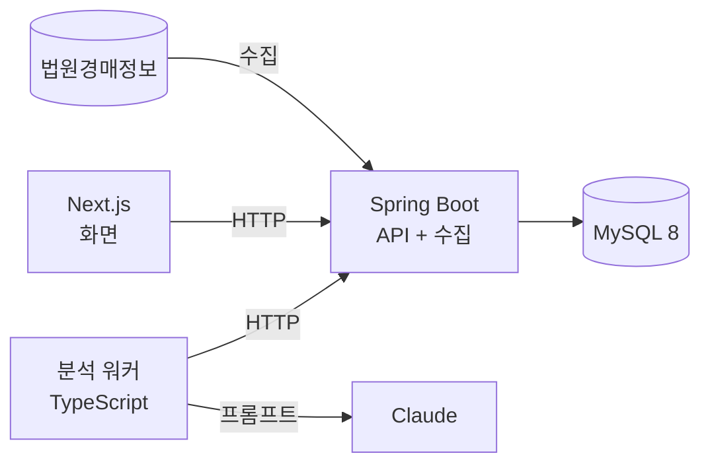

# 로드맵

> 작성일: 2026-10-07
> 지금 구조의 한계와, 그 한계를 어떤 순서로 풀지 적은 문서다. 단계마다 상태와 완료 기준을 함께 둔다.
> 기능별 상세 설계는 `openspec/changes/`에 따로 쓴다.

## 지금 상태 (2026-10-09)

- 5단계로 운영이 **Spring Boot + MySQL 단일 경로**가 됐다. 백엔드(`backend/`)가 MySQL의 유일한 주인이고 수집·사진 스케줄러를 품는다. Next.js 웹은 데이터 포트를 거쳐 백엔드 HTTP로만 읽고, 분석 워커(TypeScript)는 HTTP API로만 통신한다. SQLite, TS 수집기·사진 워커, Next JSON API는 은퇴했다(태그 `pre-retire-sqlite`).
- 완료해 아카이브한 change는 24개다(`openspec/changes/archive/`). 테스트는 TypeScript 683개, Java 789개이고, CI는 TypeScript 잡(타입 검사·테스트·빌드·린트)과 Java 잡(`./gradlew check`)을 병렬로 돈다.
- 쌓인 데이터: 이전한 809건에 전환 직후 첫 Spring 수집 466건이 더해져 물건 1,275건, 변경 이력 4,008건, 분석 12건(전환 직후 기준).
- Docker 이미지, `docker-compose.yml`, Kubernetes 매니페스트(`k8s/`, 정적 검증만)는 있다. 하지만 **상시로 운영하는 환경은 아직 없다.** 전환 때 수집·사진을 실제 사이트에서 한 회차씩만 확인했고 분석 워커는 운영 구성에 올린 적이 없다.

## 이전 구조의 한계와 5단계 이후

5단계 이전의 한계였던 "DB가 SQLite 파일 하나이고 웹 앱과 수집 워커가 그 파일을 직접 연다"는 해소됐다. 남은 한계는 다음과 같다.

| 한계 | 왜 문제인가 | 근거 |
| --- | --- | --- |
| 상시 운영 환경이 없고 장기 운용 실측이 없다 | 며칠~몇 주 돌렸을 때 차단·실패·가짜 변경이 얼마나 생기는지 모른다. 전환 뒤 수집·사진은 실제 사이트에서 각 1회차만 확인했다 | `docs/DEVELOPMENT_NOTES.md` §11, §12, §18 |
| 워커가 죽으면 사람이 다시 켜야 하고, 알림이 없다 | 상태 화면을 열어 보기 전에는 멈춘 것을 모른다 | `docs/DEVELOPMENT_NOTES.md` §11-5 |
| 인증이 없다. 관심 목록도 사용자 구분 없이 하나다 | 여러 사람이 쓸 수 없다. 쓰기 API가 열려 있어 백엔드 포트를 루프백에만 연다 | `docs/DEVELOPMENT_NOTES.md` §7.4, §11-7, §11-10 |
| MySQL 백업과 복구 절차가 없다 | 볼륨이 망가지면 수집 이력을 되살릴 수 없다. 지금 되돌릴 재료는 전환 직전 SQLite 백업 파일 하나(`backups/`)와 태그뿐이다 | — |

## 목표 구조

- Spring Boot가 DB의 유일한 주인이 된다. 화면과 분석 워커는 HTTP로만 데이터를 다룬다. **5단계에서 이 구조에 도달했다.**
- 분석 워커는 처음부터 HTTP로만 통신하게 만들었다. 그래서 API 계약만 같으면 **분석 워커 코드는 바꾸지 않는다.** 이것을 전환 과정에서 확인하는 것이 이 로드맵의 핵심 검증이었고, 5단계 전환 전후 `workers/analyzer.ts`·`workers/lib/`·`workers/prompts/`의 코드 diff는 0줄이었다(`workers/lib/api.ts`의 주석 4줄만 고쳤다).

## 단계

상태: ✅ 완료 · 🔄 진행 중 · ⏳ 예정

| 단계 | 할 일 | 완료 기준 (잴 것) | 상태 |
| --- | --- | --- | --- |
| **1. Spring 읽기 API** | `backend/`에 Spring Boot + MySQL 8을 세운다. Flyway로 테이블 8개를 1:1로 옮기고, 읽기 API 5개를 JPA + QueryDSL로 만든다. 개인 이름을 가린 시드 데이터를 적재한다 | 기존 Next.js API와 응답 JSON이 정렬 5종 × 방향 2종 × 주요 필터 조합에서 같다(계약 테스트). 목록 조회에 N+1이 없다 | ✅ 완료 (2026-10-08). 계약 테스트 90개 일치, 목록 조회 SQL 2개 고정. 기록: `openspec/changes/archive/2026-10-08-add-spring-mysql-backend/`, `docs/DEVELOPMENT_NOTES.md` 13절 |
| **2. 쓰기 API + 분석 워커 연결** | 분석 저장, 워커 회차, 관심 물건, 변동 피드, 사진 파일 API를 옮긴다. 분석 워커의 주소와 실행 파일 환경 변수만 Spring으로 바꿔 검증한다 | 개발 환경(시드 MySQL + Spring)에서 분석 워커 코드 변경 0줄, 환경 변수만 바꾼 실행으로 분석 결과가 Spring에 저장된다 | ✅ 완료 (2026-10-09). 시나리오 7개·115단계 일치, `workers/` diff 0줄, 분석 12→15건. 운영 전환은 5단계. 기록: `openspec/changes/archive/2026-10-09-add-spring-write-api/`, `docs/DEVELOPMENT_NOTES.md` 15절 |
| **3. 화면 전환** | 화면의 데이터 접근을 데이터 포트 한 곳으로 모으고, SQLite 구현과 Spring 구현을 환경 변수로 고른다(기본 SQLite). 운영 전환은 5단계에서 한다 | 페이지·컴포넌트·화면용 라우트는 데이터 포트만 쓰고 SQLite 접근은 포트의 SQLite 구현체 한 곳(린트로 강제), 기존 화면 테스트가 두 원천에서 통과한다 | ✅ 완료 (2026-10-09). 화면 5개와 변형 35건의 HTML이 두 모드에서 차이 0건(개발 환경, 스트리밍 조각 번호만 정규화), 화면당 Spring 요청 수 상한(최대 11개) 고정, 새 읽기 API 5개, 시나리오 10개·171단계 일치, 테스트 TS 923→1212·Java 332→370. 운영 기본값은 이 시점에 `sqlite`였다(5단계에서 `spring` 하나로). 기록: `openspec/changes/archive/2026-10-09-switch-web-to-data-port/`, `docs/DEVELOPMENT_NOTES.md` 16절 |
| **4. 수집 워커 이식** | 소스 어댑터와 수집·사진 워커를 Spring으로 옮긴다(스케줄러는 `TaskScheduler` 고정 주기 틱 + MySQL `GET_LOCK` 단일 실행 잠금). 물건 저장과 변경 이력 기록을 한 트랜잭션으로 묶는다. 차단 대응(1시간 쉬기)과 요청 상한을 그대로 옮긴다. 스케줄러와 외부 요청은 기본 꺼짐으로 두고, 운영 전환은 하지 않는다 | 같은 응답 샘플로 기존 수집기와 같은 저장 결과가 나온다(저장 골든 전 시나리오 일치). 수집 회차가 겹쳐 실행되지 않는다(두 인스턴스 잠금 테스트). 실제 사이트에는 요청 4개로 한 번만 확인한다 | ✅ 완료 (2026-10-09). 어댑터 골든 34사례·저장 골든 10시나리오·44단계 불일치 0건, `workers/`·`src/lib/sources/` diff 0줄, 두 인스턴스 같은 시각 틱 20회에 회차 1·나머지 overlap, 아키텍처 규칙 5개, 실제 사이트 확인 요청 4·차단 0·TS 저장 결과와 불일치 0건(같은 물건 37건), 테스트 TS 1212→1262·Java 370→723. 운영 수집·사진은 이 시점에 아직 TS 워커였고 5단계에서 전환했다. 기록: `openspec/changes/archive/2026-10-09-port-collector-to-spring/`, `docs/DEVELOPMENT_NOTES.md` 17절 |
| **5. 데이터 이전** | 운영 중인 SQLite 데이터를 MySQL로 옮기고 SQLite를 은퇴시킨다. 화면·수집·사진의 운영 전환을 데이터 이전과 함께 하고(두 수집기 동시 운영 금지), `collector_state`의 백오프·로테이션 위치도 옮긴다. 전환 뒤 TS 수집기·사진 워커·TS 어댑터·Next JSON API·데이터 포트의 SQLite 구현체를 은퇴시키고 린트 경계를 다시 정리한다 | 테이블별 행 수와 표본 값이 일치한다. 이전하는 동안 수집 공백 시간을 기록한다. 전환 뒤 첫 회차를 관찰해 차단·실패가 없음을 확인한다 | ✅ 완료 (2026-10-09). 완료 기준 해석: "행 수와 표본 값 일치"는 8개 테이블 **전수 SHA-256 해시 8/8 일치**와 이전 뒤 **API 3,326건·화면 18건 불일치 0**으로, "수집 공백"은 TS 마지막 수집 종료 → Spring 첫 수집 시작 약 17h51m으로, "첫 회차 관찰"은 결정 기록 2의 **회차 기준**(수집·사진 성공 1회 이상, 차단·실패 0, 화면 5개 200, 분석은 가짜 CLI 1회 성공)으로 읽었다. 72시간 관찰은 하지 않았고 상시 운영(6단계)의 몫이다. 가져오기 약 4초(행 4,856개), 쓰기 정지→재개 4m04s, 첫 수집 신규 466건·요청 15(상한 13 초과는 이미 시작한 법원을 끊지 않는 의도된 동작), 첫 사진 5건 중 3건 저장(2건은 상세 응답 스키마 불일치). 롤백 리허설 16.5s(런북 결함 2건 수정). 은퇴 뒤 테스트 TS 1,350→683·Java 723→789, 웹 이미지 1.49GB→1.07GB. 기록: `openspec/changes/archive/2026-10-09-migrate-data-and-cutover/`, `docs/DEVELOPMENT_NOTES.md` 18절 |
| **6. 운영 체계** | 상시 환경에 배포한다. GitHub Actions로 이미지를 빌드해 배포하고, Actuator로 지표를 낸다. 워커가 멈추면 알림을 보낸다. **MySQL `mysqldump` 백업을 만들고 복구를 실제로 한 번 해 본다**(지금은 전환 직전 SQLite 백업 파일뿐이고 그 보관 기간도 정한다). 5단계 후속 과제(아래)도 이 단계에서 처리한다. 72시간 이상 관찰로 5단계에서 못 한 장기 안정성을 잰다 | 2주 이상 운영. 실행 횟수, 성공률, 차단 횟수, 가짜 변경 건수, 감지까지 걸린 시간을 기록한다. 백업에서 복구한 DB의 행 수·해시가 원본과 같다 | ⏳ |
| **7. 인증 (선택)** | Spring Security로 로그인을 넣는다. 관심 목록과 읽음 기록에 `user_id`를 붙인다 | 쓰기 API가 인증 없이 거부된다 | ⏳ |

**5단계 후속 과제**

| 과제 | 내용 |
| --- | --- |
| 사진 상세 응답 스키마 불일치 2건 조사 | 첫 사진 회차 5건 중 2건이 상세 응답에 `dma_result.csBaseInfo`·`csPicLst`가 없어 실패했다. 사이트 오류 응답인지 구조 변경인지 확인한다(요청이 필요하므로 사람이 최소한으로) |
| 분석 워커 ↔ 실제 Spring 자동 E2E | 분석 워커는 개발 환경 수동 스크립트와 가짜 CLI 회차로만 확인했고 운영 구성에 올린 적이 없다. 실제 Claude 호출 포함 첫 회차를 확인하고 자동화한다 |
| 화면 ↔ Spring E2E | 화면은 대역 `fetch`로 렌더링을 검증한다. 실제 백엔드를 붙인 자동 테스트가 없다 |
| 이미지 크기 측정 | 웹 이미지는 1.49GB→1.07GB(총량만 측정). 빌드 도구·네이티브 모듈 기여 분해와 백엔드·분석 워커 이미지 최적화는 하지 않았다 |
| `.env` DB 비밀번호 강화 | 운영 구성은 `${VAR:?}`로 필수화했지만 값의 강도는 강제하지 않는다 |
| 첫 `compare-screens` 종료 코드 1의 원인 | 재실행 3회는 차이 0이었다. 도구가 은퇴해 재현하지 못한다(기록만) |

**병행 (권장)**: 5단계에서 운영 구성이 바뀌었으므로, 상시로 켜 둘 환경을 정해 `docker compose up`으로 6단계 전의 기준 수치(성공률, 차단 횟수, 응답 시간)를 쌓는다. 상시로 켜 둘 환경은 아직 정하지 않았다.

## 하지 않는 것

| 하지 않는 것 | 이유 |
| --- | --- |
| Kafka 같은 메시지 큐, MSA로 서비스 쪼개기 | 서버 한 대, 물건 수천 건 규모에서는 근거가 없다. 워커 사이 통신은 HTTP로 충분하다 |
| Redis 캐시 | 쿼리를 재 봤는데도 느릴 때만 넣는다. 지금은 잰 적이 없다 |
| 실제 Kubernetes 클러스터 운영 | 매니페스트는 유지하지만, 서버 한 대 운영에는 Docker Compose가 맞다 |
| 수집 범위 확대 | 대상 사이트의 부담과 차단 위험 때문에 1~5단계에서는 지금 범위를 유지했다. 6단계 운영 기록이 쌓인 뒤에 정한다 |

## 단계마다 남길 것

- 기능마다 OpenSpec 스펙(proposal·design·specs·tasks)을 먼저 쓴다.
- 바꾸기 전과 후의 수치를 `docs/DEVELOPMENT_NOTES.md`에 남긴다. 응답 시간, 쿼리 실행 계획, 테스트 수 같은 것이다.
- 고른 방법과 버린 대안을 그 change의 `design.md`에 남긴다.
