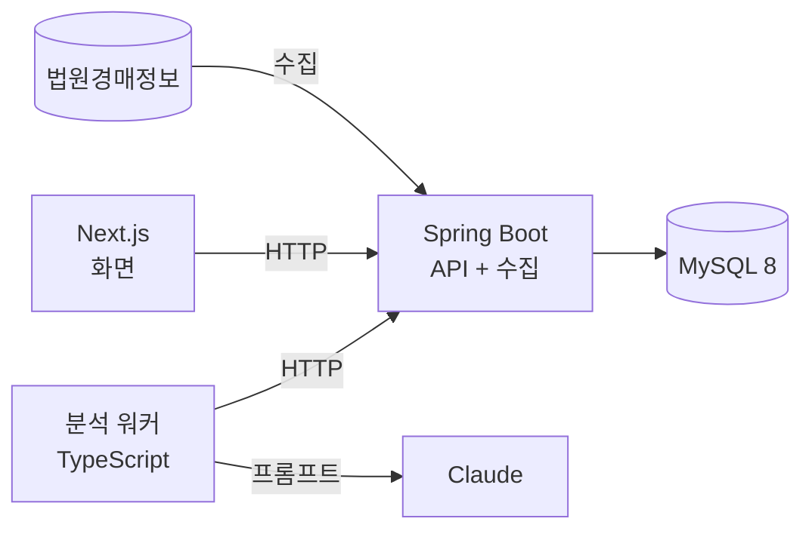

# 로드맵

> 작성일: 2026-10-07
> 지금 구조의 한계와, 그 한계를 어떤 순서로 풀지 적은 문서다. 단계마다 상태와 완료 기준을 함께 둔다.
> 기능별 상세 설계는 `openspec/changes/`에 따로 쓴다.

## 지금 상태 (2026-10-08)

- TypeScript + Next.js 15 + SQLite. 수집 워커, 웹 앱, 분석 워커가 각각 독립된 프로세스로 돈다.
- 완료한 기능은 18개다(`openspec/changes/archive/`). 테스트는 TypeScript 791개, Java 215개이고, CI는 TypeScript 잡(타입 검사·테스트·빌드·린트)과 Java 잡(`./gradlew check`)을 병렬로 돈다.
- 1단계로 `backend/`에 Spring Boot + MySQL 읽기 API가 생겼다. 화면·수집·분석 워커는 아직 기존 Next.js + SQLite 경로를 쓴다.
- 쌓인 데이터: 물건 809건(서울중앙지방법원), 변경 이력 4,008건, 분석 12건.
- Docker 이미지, `docker-compose.yml`, Kubernetes 매니페스트(`k8s/`)는 있다. 하지만 상시로 운영하는 환경은 아직 없다.

## 지금 구조의 한계

| 한계 | 왜 문제인가 | 근거 |
| --- | --- | --- |
| DB가 SQLite 파일 하나이고, 웹 앱과 수집 워커가 그 파일을 직접 연다 | 서버를 여러 대로 늘리거나 워커를 다른 머신으로 떼어 배포할 수 없다. 스키마도 `CREATE TABLE IF NOT EXISTS`와 `ALTER` 보정만으로 관리하고 있다 | `src/lib/db/` |
| 연속 운용을 약 15분, 5회만 검증했다 | 며칠 동안 돌렸을 때 차단·실패·가짜 변경이 얼마나 생기는지 모른다. 남은 질문 9개 중 6개가 이것에 막혀 있다 | `docs/DEVELOPMENT_NOTES.md` §11, §12 |
| 워커가 죽으면 사람이 다시 켜야 하고, 알림이 없다 | 상태 화면을 열어 보기 전에는 멈춘 것을 모른다 | `docs/DEVELOPMENT_NOTES.md` §11-5 |
| 인증이 없다. 관심 목록도 사용자 구분 없이 하나다 | 여러 사람이 쓸 수 없다. 쓰기 API가 열려 있다 | `docs/DEVELOPMENT_NOTES.md` §7.4, §11-7, §11-10 |
| 백업과 복구 절차가 없다 | 볼륨이 망가지면 수집 이력을 되살릴 수 없다 | — |

## 목표 구조

- Spring Boot가 DB의 유일한 주인이 된다. 화면과 분석 워커는 HTTP로만 데이터를 다룬다.
- 분석 워커는 처음부터 HTTP로만 통신하게 만들었다. 그래서 API 계약만 같으면 **분석 워커 코드는 바꾸지 않는다.** 이것을 전환 과정에서 확인하는 것이 이 로드맵의 핵심 검증이다.

## 단계

상태: ✅ 완료 · 🔄 진행 중 · ⏳ 예정

| 단계 | 할 일 | 완료 기준 (잴 것) | 상태 |
| --- | --- | --- | --- |
| **1. Spring 읽기 API** | `backend/`에 Spring Boot + MySQL 8을 세운다. Flyway로 테이블 8개를 1:1로 옮기고, 읽기 API 5개를 JPA + QueryDSL로 만든다. 개인 이름을 가린 시드 데이터를 적재한다 | 기존 Next.js API와 응답 JSON이 정렬 5종 × 방향 2종 × 주요 필터 조합에서 같다(계약 테스트). 목록 조회에 N+1이 없다 | ✅ 완료 (2026-10-08). 계약 테스트 90개 일치, 목록 조회 SQL 2개 고정. 기록: `openspec/changes/archive/2026-10-08-add-spring-mysql-backend/`, `docs/DEVELOPMENT_NOTES.md` 13절 |
| **2. 쓰기 API + 분석 워커 연결** | `POST /api/analyses`, 워커 회차 기록, 관심 물건 API를 옮긴다. 분석 워커의 주소만 Spring으로 바꾼다 | **분석 워커 코드 변경 0줄**로 Spring에 분석 결과가 저장된다 | ⏳ |
| **3. 화면 전환** | Next.js 화면이 DB를 직접 열지 않고 Spring API를 부르게 바꾼다 | `src/` 안에서 `better-sqlite3`를 쓰는 화면 코드가 0개다. 기존 화면 테스트가 통과한다 | ⏳ |
| **4. 수집 워커 이식** | 수집을 Spring `@Scheduled`로 옮긴다. 물건 저장과 변경 이력 기록을 한 트랜잭션으로 묶는다. 차단 대응(1시간 쉬기)과 요청 상한을 그대로 옮긴다 | 같은 응답 샘플로 기존 수집기와 같은 저장 결과가 나온다. 수집 회차가 겹쳐 실행되지 않는다 | ⏳ |
| **5. 데이터 이전** | 운영 중인 SQLite 데이터를 MySQL로 옮기고 SQLite를 은퇴시킨다 | 테이블별 행 수와 표본 값이 일치한다. 이전하는 동안 수집 공백 시간을 기록한다 | ⏳ |
| **6. 운영 체계** | 상시 환경에 배포한다. GitHub Actions로 이미지를 빌드해 배포하고, Actuator로 지표를 낸다. 워커가 멈추면 알림을 보낸다. `mysqldump` 백업을 만들고 **복구를 실제로 한 번 해 본다** | 2주 이상 운영. 실행 횟수, 성공률, 차단 횟수, 가짜 변경 건수, 감지까지 걸린 시간을 기록한다 | ⏳ |
| **7. 인증 (선택)** | Spring Security로 로그인을 넣는다. 관심 목록과 읽음 기록에 `user_id`를 붙인다 | 쓰기 API가 인증 없이 거부된다 | ⏳ |

**병행 (권장)**: 1단계를 하는 동안 지금 버전을 상시 환경에서 그대로 띄워 둔다(`docker compose up`). 코드는 바꾸지 않는다. 이렇게 하면 전환하기 전의 기준 수치(성공률, 차단 횟수, 응답 시간)가 쌓이고, 6단계와 비교할 수 있다. 상시로 켜 둘 환경은 아직 정하지 않았다.

## 하지 않는 것

| 하지 않는 것 | 이유 |
| --- | --- |
| Kafka 같은 메시지 큐, MSA로 서비스 쪼개기 | 서버 한 대, 물건 수천 건 규모에서는 근거가 없다. 워커 사이 통신은 HTTP로 충분하다 |
| Redis 캐시 | 쿼리를 재 봤는데도 느릴 때만 넣는다. 지금은 잰 적이 없다 |
| 실제 Kubernetes 클러스터 운영 | 매니페스트는 유지하지만, 서버 한 대 운영에는 Docker Compose가 맞다 |
| 수집 범위 확대 | 대상 사이트의 부담과 차단 위험 때문에 1~5단계에서는 지금 범위를 유지한다. 6단계 운영 기록이 쌓인 뒤에 정한다 |

## 단계마다 남길 것

- 기능마다 OpenSpec 스펙(proposal·design·specs·tasks)을 먼저 쓴다.
- 바꾸기 전과 후의 수치를 `docs/DEVELOPMENT_NOTES.md`에 남긴다. 응답 시간, 쿼리 실행 계획, 테스트 수 같은 것이다.
- 고른 방법과 버린 대안을 그 change의 `design.md`에 남긴다.
